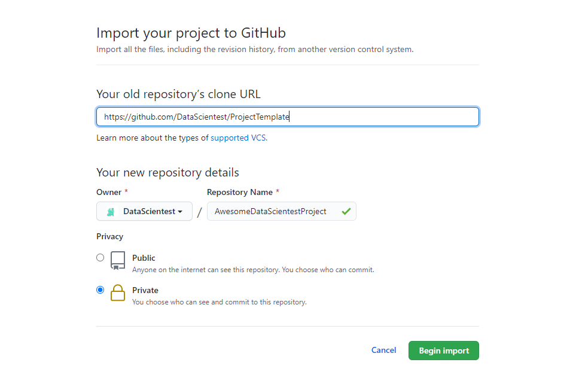

# ProjectTemplate

## Instructions à destination des chefs de projet

Ce template permet d'initialiser le repository d'un projet fil rouge dans le cadre de la formation [DataScientest](https://datascientest.com/). Pour ce faire, merci de suivre les instructions suivantes (**chef de projet**):

- Importez (https://github.com/new/import) ce repository (https://github.com/DataScientest-Studio/project-template) dans un nouveau **repository privé dans l'organisation DataScientest-Studio**.



- Modifiez le README.md du nouveau projet (vous pouvez le faire directement depuis l'appli web GitHub via l'adresse https://github.com/DataScientest-Studio/NOM_DU_REPO/edit/main/README.md) :
  - Supprimez la présente section (Instructions à destination des chefs de projet)
  - Remplacez le titre `# ProjectTemplate` par `# Nom Du Projet`
- Supprimez l'image d'explication d'importation du repo :
  https://github.com/DataScientest-Studio/NOM_DU_REPO/delete/main/images/import-project-template.png
- Vous pouvez désormais ajouter les membres du projet au repo via la page : https://github.com/DataScientest-Studio/NOM_DU_REPO/settings/access

## Explications et Instructions

Ce repository contient les fichiers nécessaires à l'initialisation d'un projet fil-rouge dans le cadre de votre formation [DataScientest](https://datascientest.com/).

Il contient principalement le présent fichier README.md et un template d'application [Streamlit](https://streamlit.io/).

**README**

Le fichier README.md est un élément central de tout repository git. Il permet de présenter votre projet, ses objectifs, ainsi que d'expliquer comment installer et lancer le projet, ou même y contribuer.

Vous devrez donc modifier différentes sections du présent README.md, afin d'y inclure les informations nécessaires.

- Complétez **en anglais** les sections (`## Presentation` et `## Installation` `## Streamlit App`) en suivant les instructions présentes dans ces sections.
- Supprimer la présente section (`## Explications et Instructions`)

**Application Streamlit**

Un template d'application [Streamlit](https://streamlit.io/) est disponible dans le dossier [`streamlit_app`](streamlit_app). Vous pouvez partir de ce template pour mettre en avant votre projet.

## Presentation

Complétez cette section **en anglais** avec une brève description de votre projet, le contexte (en incluant un lien vers le parcours DataScientest), et les objectifs.

Vous pouvez également ajouter une brève présentation des membres de l'équipe avec des liens vers vos réseaux respectifs (GitHub et/ou LinkedIn par exemple).

**Exemple :**

This repository contains the code for our project **PROJECT_NAME**, developed during our [Data Scientist training](https://datascientest.com/en/data-scientist-course) at [DataScientest](https://datascientest.com/).

The goal of this project is to **...**

This project was developed by the following team :

- John Doe ([GitHub](https://github.com/) / [LinkedIn](http://linkedin.com/))
- Martin Dupont ([GitHub](https://github.com/) / [LinkedIn](http://linkedin.com/))

You can browse and run the [notebooks](./notebooks). You will need to install the dependencies (in a dedicated environment) :

```
pip install -r requirements.txt
```

## Streamlit App

**Add explanations on how to use the app.**

To run the app :

```shell
cd streamlit_app
conda create --name my-awesome-streamlit python=3.9
conda activate my-awesome-streamlit
pip install -r requirements.txt
streamlit run app.py
```

The app should then be available at [localhost:8501](http://localhost:8501).

**Docker**

You can also run the Streamlit app in a [Docker](https://www.docker.com/) container. To do so, you will first need to build the Docker image :

```shell
cd streamlit_app
docker build -t streamlit-app .
```

You can then run the container using :

```shell
docker run --name streamlit-app -p 8501:8501 streamlit-app
```

And again, the app should then be available at [localhost:8501](http://localhost:8501).
